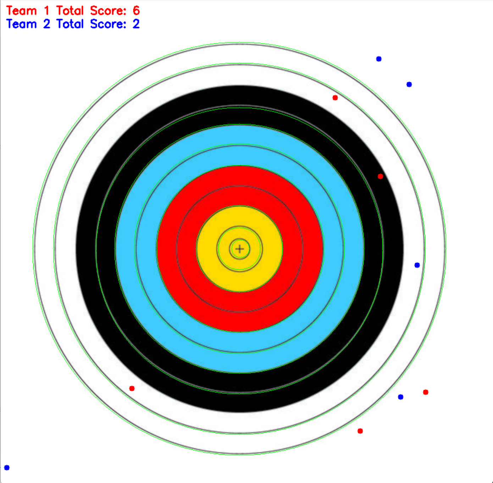
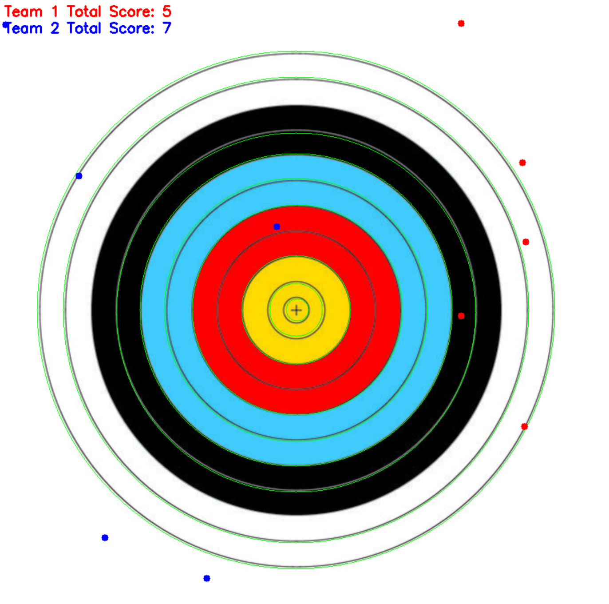

## Recognizing scores on a dartboard

Recognizing the scores of five randomly positioned darts allocated to Team 1 and Team 2 on a dartboard.

## step
>1. Finding contours after image processing.
>2. Scoring based on contour positions.
>3. Random positions of five points.
>4. Calculating scores for each team.
>
>

## Requirements
>1. python(3.7.3)
>2. opencv(4.1.0)
>3. numpy(1.61.4)
>4. random
>5. math

## Result
Example photo 1

Example photo 2

